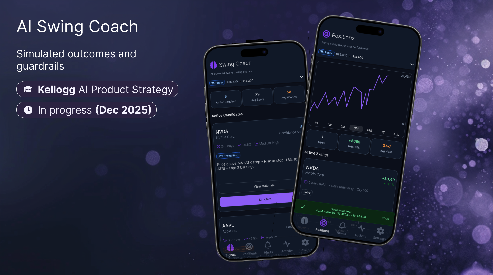
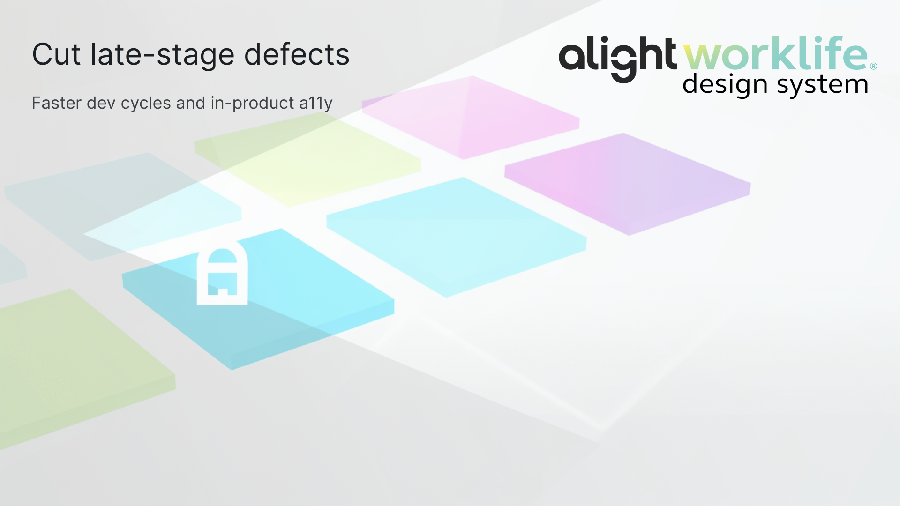
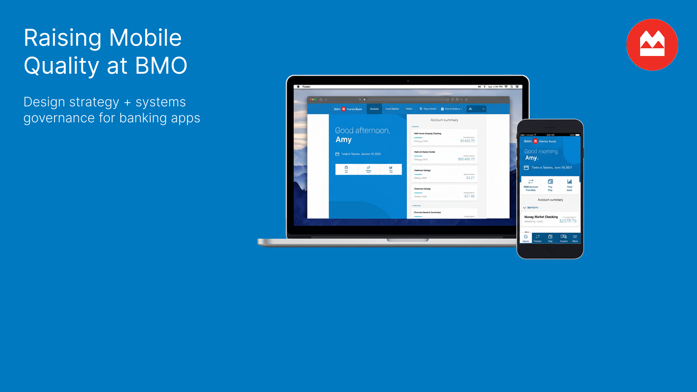
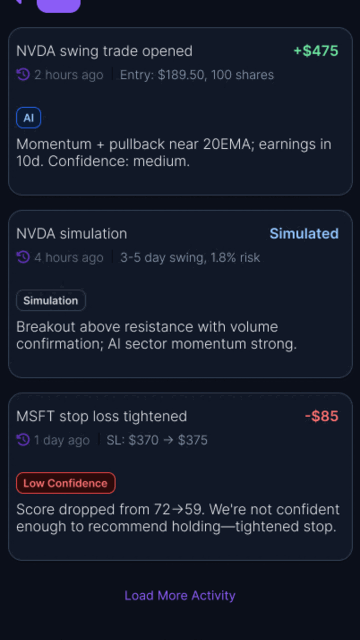

# Rafael Flores Portfolio

Live demo: https://rafaelflores.net

## Run locally

1. Use Node.js 20 (`nvm use 20`).
2. Install dependencies: `npm ci`
3. Start dev server: `npm run dev`
4. Open `http://localhost:5173`

## Useful scripts

- `npm run build` - production build (includes sitemap generation + react-snap step)
- `npm run preview` - preview the production build locally
- `npm run lint` - run ESLint checks

## What this demonstrates

- Production-ready React + Vite portfolio architecture.
- Route-based case studies with reusable UI components.
- Accessibility-minded UX (semantic structure, keyboard support, no-JS fallback).
- Design-system-driven consistency across content-rich pages.

## Screenshots

## GIF

